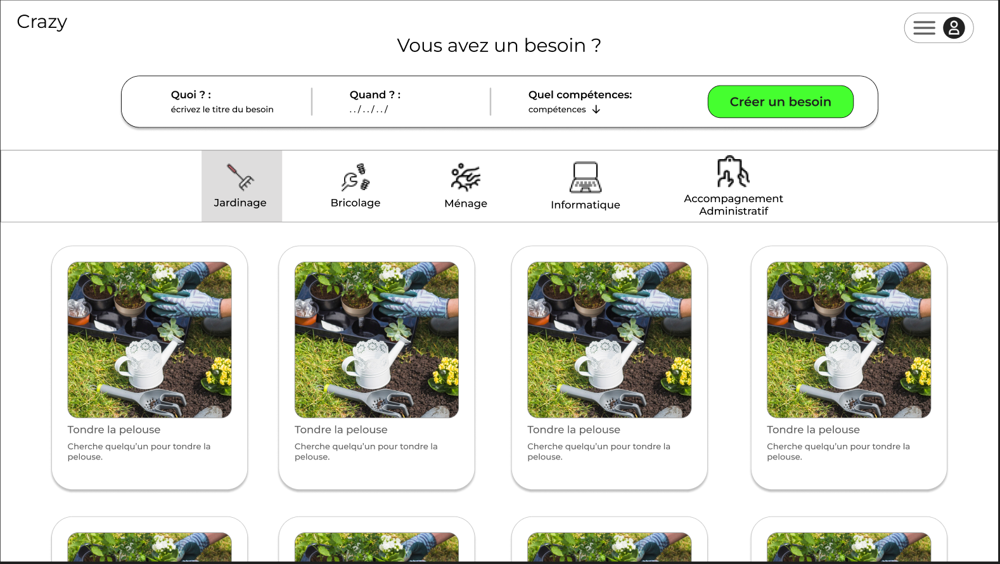
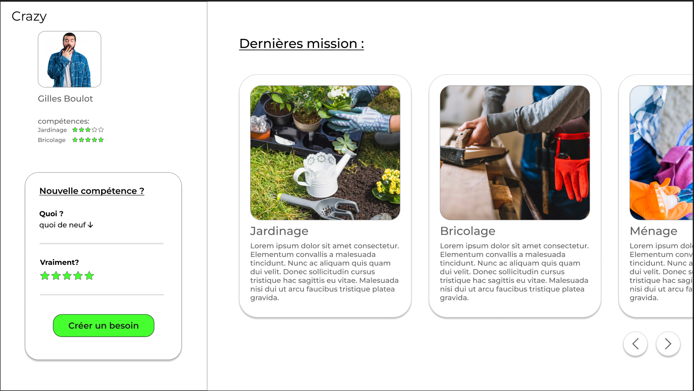
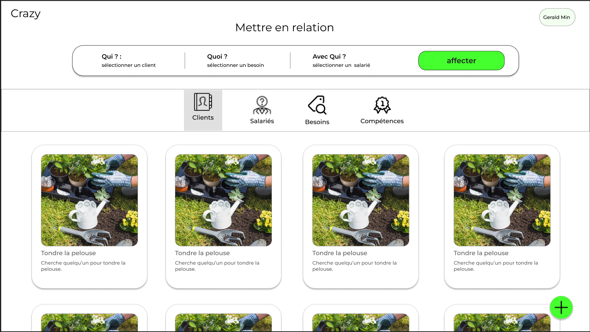

# CrazyCharlyDay 2025

## Résumé du projet : 

Les fonctionnalités faites ou presque :
1, 4, 7, 2, 8, 12, (10)

Le backend contient toutes les routes nécessaires, cependant la liaison avec le frontend a été retardée par des complications liées au déploiement du docker-compose.

Le projet prévoit cependant une implémentation plus complète avec des composants visuels manquant seulement de requêtes afin d'injecter les données du backend.

Notre algorithme se base sur la recherche par tabou, ses résultats sont obtenus en moins d'une secondes et sont globalement meilleurs que ceux attendus.

### Technologies : 

Backend : API REST, JAVA, SPRINGBOOT

Frontend : VUE.js, javascript, axios, pinia

Algorithme : Timefold (auto solver avec contrainte)

Déploiement : docker

### Maquettes : 

#### home view

#### profile view

#### admin view

### Conclusion

On a eu les yeux plus gros que le ventre.

Lien du github : https://github.com/Mape57/crazy_charly_day_2025

Lien du Docketu : [http://docketu](http://docketu.iutnc.univ-lorraine.fr:40444/)
